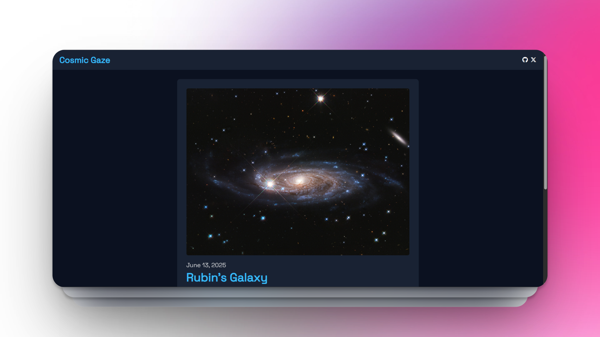

# Cosmic Gaze

Cosmic Gaze is a simple web application that allows users to explore NASA's Astronomy Picture of the Day (APOD). Users can view the daily image or video, browse previous or random dates, and read detailed explanations about each astronomical observation. The app features a clean interface, date navigation, and robust error handling for a smooth user experience.

[Live Demo](https://cosmic-gaze.vercel.app)
